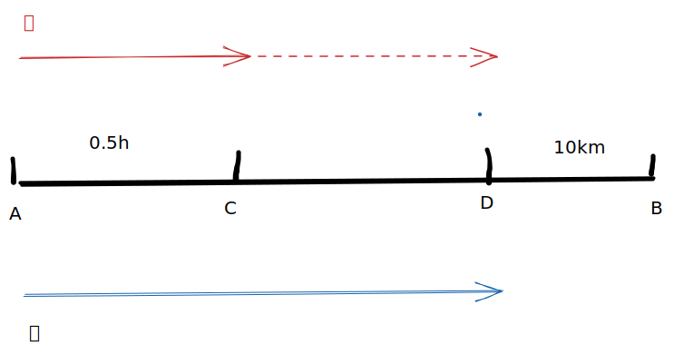

# ⭐ 行程问题

行程问题是应用题中最重要的一种题型，难度大，题型多，并且与工程问题息息相关，所以需要掌握其方法与本质。简而言之，行程问题我将其分类为以下五类，掌握以下五类即可。

1. 定速直线行程问题
2. 变速直线行程问题
3. 多次往返相遇问题
4. 跑圈问题
5. 流水行船问题

## 定速直线行程问题

### 理论部分

定速直线行程顾名思义，速度在直线行程上不发生变化的问题，总体围绕着V = S \* T这个公式展开。

下面介绍所需要掌握的理论部分。

【比例法】

比例法是高效率解题的关键，一定要掌握好

1. <mark style="color:purple;">**S相同，V和T成反比**</mark>（适用于追及问题，甲乙走相同的距离）
   * 甲追上乙，追及问题
2. <mark style="color:purple;">**T相同，S与V成正比**</mark>（适用于同时出发的问题，甲乙所用时间相同）
   * 甲乙同时出发，到达某地
   * 甲乙同时出发，相遇
3. <mark style="color:purple;">**V相同，S和T成正比**</mark>


一定要去找甲乙之间相同的行驶距离或者相同的时间，往往是破题点，得到比例关系，就能快速解题


【中点思维】V甲>V乙，甲乙相遇时，甲离中点的距离是A，**则甲比乙多走2A**（对称性）

【早到思维】同时出发，甲比乙早到T分钟，乙距终点还有A千米，**则乙的速度为A/T**

【求甲乙速度比】甲乙速度未知，一定要先找甲乙两者的共同路程，寻找有差异的地方。

【速度差、路程差问题】

* 甲比乙的速度快A，即速度差为△V，要想到 T = △S / △V这个式子。
* 甲比乙多走路程S，即路程差为△S，要想到 T = △S / △V这个式子。

### 实践部分

**【2019国考地市】甲车上午8点从A地出发匀速开往B地，出发30分钟后乙车从A地出发以甲车2倍的速度前往B地，并在距离B地10千米时追上甲车。如乙车9点10分到达B地，问甲车的速度为多少千米/小时？**

A.30 &#x20;

B.36 &#x20;

C.45&#x20;

D.60

【方法一：从S相同出发】

从题干知 V甲 = 2V乙，并分析甲乙整个追及过程，发现他们走了相同的距离（AD），于是利用路程相同，速度与时间成反比

则V甲：V乙 = T乙 ：T甲 = 1 : 2，又因为 T甲 = 0.5h + T乙，解得T甲 = T乙 = 0.5h

因此乙追及过程花了0.5h，DB路段只使用10min，解出V乙 = 60km/h，因此V甲 = 30km/h

【方法二：从T相同出发】

分析时间相同的路程段，也就是乙出发到相遇这段时间，乙走了AD，甲走了CD。

时间相同，路程与速度成正比，所以AD：CD = 2 : 1，进而得到AC = CD = 1:1，所以相同的距离，甲在CD上、乙在AD上用了0.5h。

因此乙追及过程花了0.5h，DB路段只使用10min，解出V乙 = 60km/h，因此V甲 = 30km/h

## 变速直线行程问题

### 理论部分

与上一节不同的是，速度在直线上发生了变化，因此难度也提高了，但是变速行程问题有一个万能公式法，只要掌握了该公式，可以解决所有变速行程问题23。

【万能公式】

$$
V1 * V2 = S * \frac{△V}{△T}
$$

V1，V2：变化前的速度与变化后的速度。

S：速度变化所经过的路程

△V：速度变化差

△T：速度变化引起的时间差
